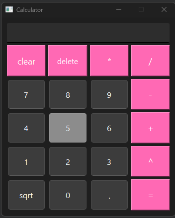

# Калькулятор на Qt

## Обзор
Проект представляет собой приложение-калькулятор, созданное с использованием Qt. Оно позволяет выполнять базовые арифметические операции, такие как сложение, вычитание, умножение, деление, возведение в квадрат и извлечение квадратного корня.

## Особенности
- **Базовые операции**: Сложение, вычитание, умножение, деление.
- **Расширенные операции**: Возведение в квадрат, извлечение квадратного корня.

## Использование
Используйте кнопки интерфейса или клавиатуру для ввода чисел и выполнения операций.

## Описание функций
1) `Calculator::Calculator()`: Конструктор класса, инициализирует кнопки и поле ввода. Устанавливает соединения между кнопками и их слотами для обработки событий.
2) `void Calculator::sqrt()`: Извлекает число из поля ввода, далее проверяет, является ли число отрицательным. Если число оказалось отрицательным, выводит сообщение об ошибке.
В противном случае вычисляет квадратный корень числа и выводит результат на экран.
3) `void Calculator::square()`: Извлекает число из поля ввода, далее вычисляет квадрат числа и выводит результат на экран.
4) `void Calculator::mathOperation(QString oprt)`: Извлекает первое введенное число из поля ввода, далее сохраняет выбранную операцию для последующего вычисления.
5) `void Calculator::equal()`: Извлекает второе введенное число из поля ввода, далее выполняет выбранную арифметическую операцию с двумя числами. Также выводит результат на экран или сообщает об ошибке при делении на ноль.
6) `void Calculator::pointAndNum()`: Обрабатывает нажатие кнопок с числами и точкой. Выводит введенные символы на экран и управляет корректным вводом десятичных чисел.
7) `void Calculator::zero()`: Добавляет ноль к текущему вводу, если он еще не начат и подготавливает калькулятор для следующего ввода числа.
8) `void Calculator::clearAll()`: Удаляет последний символ или устанавливает "0", если ввод пуст.
9) `Calculator::~Calculator()`: Деструктор класса, удаляющий элементы интерфейса.
